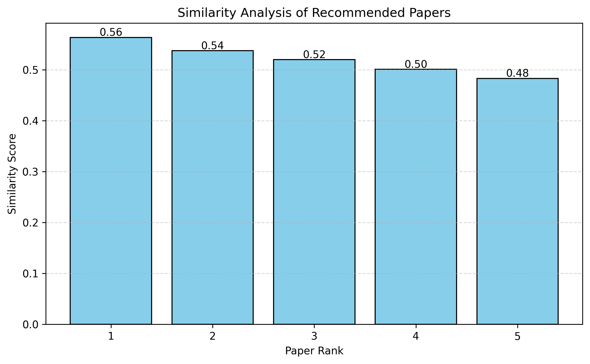
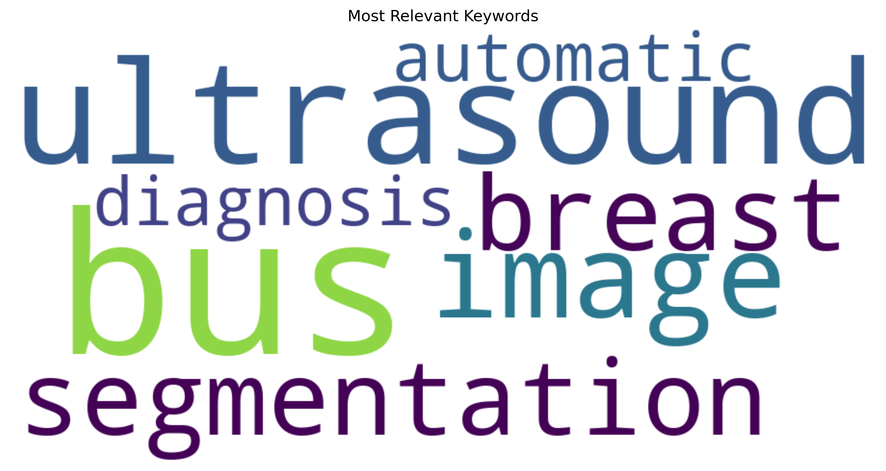

# 📚 Research Paper Recommendation System using NLP

An end-to-end NLP pipeline that recommends the most relevant research paper for a natural-language query, then automatically summarizes it, extracts keywords and named entities, visualizes similarity scores, and exports everything as a shareable PDF report.

## Overview

Given a query like *"deep learning for medical image analysis"*, the system:

1. Encodes the query and ~15,000 arXiv ML paper abstracts into dense vector embeddings
2. Retrieves the most semantically similar paper using a FAISS vector index
3. Generates an abstractive AI summary of the paper's abstract
4. Extracts keyphrases and named entities from the summary
5. Visualizes similarity scores and keyword frequency
6. Compiles everything into a formatted PDF report

## Features

| Feature | Technique / Model |
|---|---|
| Semantic Search | `sentence-transformers/all-MiniLM-L6-v2` + FAISS |
| Paper Recommendation | Cosine similarity over normalized embeddings |
| AI Summarization | `facebook/bart-large-cnn` |
| Keyword Extraction | KeyBERT |
| Named Entity Recognition | spaCy (`en_core_web_sm`) |
| Similarity Visualization | Matplotlib bar chart |
| Keyword Visualization | WordCloud |
| Report Export | ReportLab (PDF) |
| Console Output | Rich (panels & tables) |

## Dataset

[`CShorten/ML-ArXiv-Papers`](https://huggingface.co/datasets/CShorten/ML-ArXiv-Papers) from the Hugging Face Hub — titles and abstracts of machine learning papers from arXiv. The notebook uses a 15,000-paper subset for speed; you can increase this in the preprocessing step.

## Project Structure

```
.
├── notebooks/
│   └── research_paper_recommender.ipynb   # Main notebook — run top to bottom
├── requirements.txt                       # Python dependencies
├── .gitignore
├── LICENSE
└── README.md
```

Running the notebook will generate a few artifacts in the working directory (not tracked in git — see `.gitignore`):

- `paper_embeddings.npy` — cached sentence embeddings
- `paper_faiss.index` — cached FAISS index
- `similarity_graph.png`, `wordcloud.png` — generated visualizations
- `Research_Report_<query>.pdf` — generated report per query

## Getting Started

### 1. Clone the repository

```bash
git clone https://github.com/<your-username>/<your-repo-name>.git
cd <your-repo-name>
```

### 2. Set up an environment

```bash
python -m venv venv
source venv/bin/activate   # On Windows: venv\Scripts\activate
pip install -r requirements.txt
python -m spacy download en_core_web_sm
```

### 3. Run the notebook

```bash
jupyter notebook notebooks/research_paper_recommender.ipynb
```

Run all cells in order. The first run will download the dataset and models and build the embedding cache; subsequent runs reuse the cached embeddings and FAISS index.

### 4. Try your own query

At the bottom of the notebook, call:

```python
search_and_summarize("your query here", k=5)
```

## Example

```python
search_and_summarize("Brain Tumor Detection using Deep Learning", k=5)
```

This prints the top recommended paper, its similarity score, an AI-generated summary, detected named entities, extracted keywords, and saves a similarity chart, word cloud, and PDF report.

## Tech Stack

Python · PyTorch · Hugging Face `transformers` & `datasets` · `sentence-transformers` · FAISS · KeyBERT · spaCy · Matplotlib · WordCloud · ReportLab · Rich

## Sample Output

**Similarity Score Analysis**



**Extracted Keyword Word Cloud**



## Possible Improvements

- Swap `IndexFlatIP` for an approximate index (e.g. `IndexIVFFlat`) to scale beyond the current dataset size
- Add a lightweight web UI (Streamlit/Gradio) on top of `search_and_summarize`
- Cross-encoder re-ranking of top-k results for higher precision
- Batch evaluation against a labeled query/paper relevance set

## License

This project is licensed under the [MIT License](LICENSE).

## Author

**Soham Mahure**
